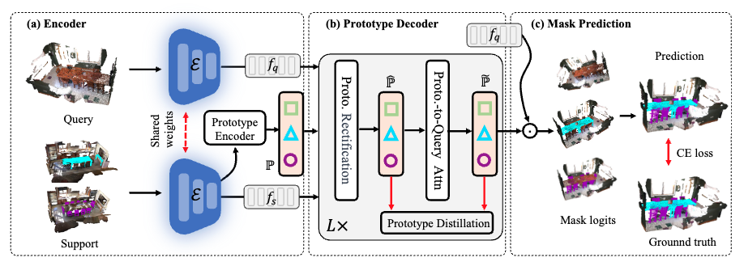

# Dynamic Prototype Adaptation with Distillation for Few-shot Point Cloud Semantic Segmentation

[Paper](https://arxiv.org/pdf/2401.16051) in 3DV2024 



## Introduction

Few-shot point cloud segmentation seeks to generate per-point mask for previously unseen categories, using only a minimal set of annotated point clouds as reference. Existing prototype-based methods rely on support prototypes to guide the segmentation of query point clouds, but they encounter challenges when significant object variations exist between the support prototypes and query features. In this work, we present dynamic prototype adaptation (DPA), which explicitly learns task-specific prototypes for each query point cloud to tackle the object variations problem. DPA achieves the adaptation through prototype rectification, aligning 
vanilla prototypes from support with the query feature distribution, and prototype-to-query attention, extracting task-specific context from query point clouds. Furthermore, we introduce prototype distillation regularization term, enabling knowledge transfer between early-stage prototypes and their deeper counterparts during adaption. By iteratively applying these adaptations, we generate task-specific prototypes for accurate mask predictions on query point clouds. Extensive experiments on two popular benchmarks show that DPA surpasses state-of-the-art methods by a significant margin,  e.g., 7.43\% and 6.39\% under the 2-way 1-shot setting on S3DIS and ScanNet, respectively. 


## Installation
- Install `python` --This repo is tested with `python 3.6.8`.
- Install `pytorch` with CUDA -- This repo is tested with `torch 1.4.0`, `CUDA 10.1`. 
It may work with newer versions, but that is not gauranteed.
- Install `faiss` with cpu version
- Install 'torch-cluster' with the corrreponding torch and cuda version
	```
	pip install torch-cluster==latest+cu101 -f https://pytorch-geometric.com/whl/torch-1.5.0.html
	```
- Install dependencies
    ```
    pip install tensorboard h5py transforms3d
    ```

## Usage
### Data preparation
#### S3DIS
1. Download [S3DIS Dataset Version 1.2](http://buildingparser.stanford.edu/dataset.html).
2. Re-organize raw data into `npy` files by running
   ```
   cd ./preprocess
   python collect_s3dis_data.py --data_path $path_to_S3DIS_raw_data
   ```
   The generated numpy files are stored in `./datasets/S3DIS/scenes/data` by default.
3. To split rooms into blocks, run 

    ```python ./preprocess/room2blocks.py --data_path ./datasets/S3DIS/scenes/```
    
    One folder named `blocks_bs1_s1` will be generated under `./datasets/S3DIS/` by default. 


#### ScanNet
1. Download [ScanNet V2](http://www.scan-net.org/).
2. Re-organize raw data into `npy` files by running
	```
	cd ./preprocess
	python collect_scannet_data.py --data_path $path_to_ScanNet_raw_data
	```
   The generated numpy files are stored in `./datasets/ScanNet/scenes/data` by default.
3. To split rooms into blocks, run 

    ```python ./preprocess/room2blocks.py --data_path ./datasets/ScanNet/scenes/ --dataset scannet```
    
    One folder named `blocks_bs1_s1` will be generated under `./datasets/ScanNet/` by default. 


### Running 
#### Training
First, pretrain the segmentor which includes feature extractor module on the available training set:
    
    cd scripts
    bash pretrain.sh

Second, train our method:
	
	bash train.sh


#### Evaluation
    
    bash eval.sh

Note that the above scripts are used for 2-way 1-shot on S3DIS (S^0). You can modified the corresponding hyperparameters to conduct experiments on other settings. 


## Citation
Please cite our paper if it is helpful to your research:

@misc{liu2024dynamic,
      title={Dynamic Prototype Adaptation with Distillation for Few-shot Point Cloud Segmentation}, 
      author={Jie Liu and Wenzhe Yin and Haochen Wang and Yunlu CHen and Jan-Jakob Sonke and Efstratios Gavves},
      year={2024},
      eprint={2401.16051},
      archivePrefix={arXiv},
      primaryClass={cs.CV}
}


## Acknowledgement
We thank [attMPTI](https://github.com/Na-Z/attMPTI) and [DGCNN (pytorch)](https://github.com/WangYueFt/dgcnn/tree/master/pytorch) for their excellent open-source work.
